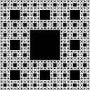

# Fracdustry Reimagined

[>> Download <<](https://github.com/AnotherFractal/FracdustryReimagined/actions)

*Thank you, MikhailTapio.*

> **This mod is open source and under a permissive license.** As such, it can be included in any modpack on any platform without prior permission. We appreciate hearing about people using our mods, but you do not need to ask to use them. See the [LICENSE file](LICENSE) for more details.

A unique technology modification ported from Forge to Fabric.

## Status

Currently the project is not yet implemented and lacks of a bunch of features. However, you can get the development build in [GitHub Actions](https://github.com/AnotherFractal/FracdustryReimagined/actions).
